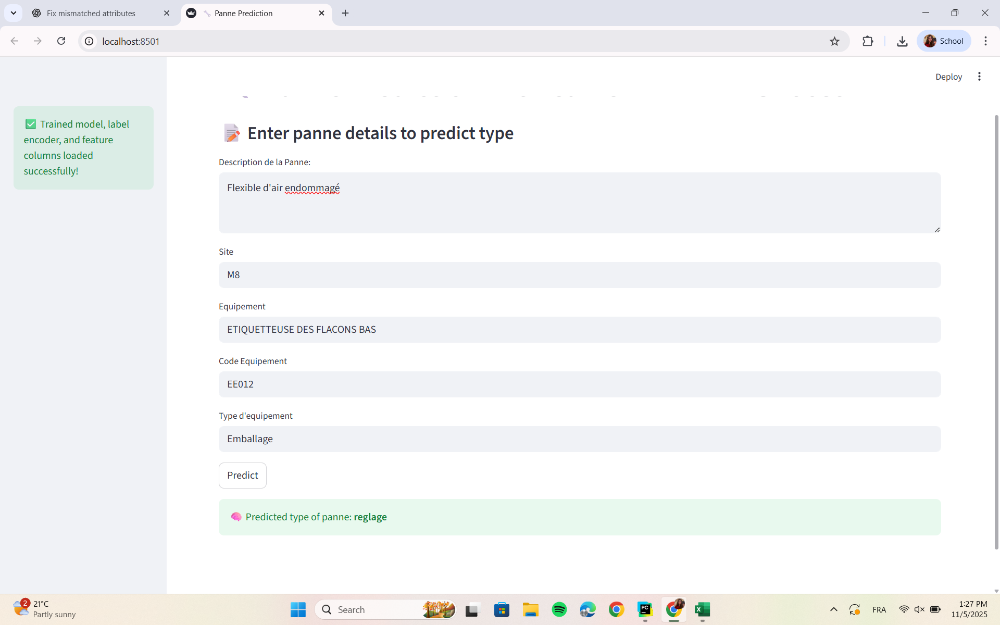

# 🔧 Failure Prediction using CamemBERT + XGBoost

This project predicts the type of equipment failure (**panne**) based on textual and structured maintenance data.  
It combines **CamemBERT sentence embeddings** for French text with **XGBoost** classification for accurate and interpretable predictions.  
A **Streamlit app** is included for easy interaction and testing.

---

## 📁 Project Structure
````

panne-prediction-xgboost-camembert/
│
├── data/
│ └── medis_data1.xlsx # (Not included in repo for privacy)
│
├── models/
│ ├── xgb_model.pkl # Saved trained model
│ ├── label_encoder.pkl # Label encoder for target classes
│ └── feature_columns.pkl # List of features used for training
│
├── src/
│ ├── data_cleaning.py # Data loading and cleaning
│ ├── feature_engineering.py # Embedding & encoding
│ ├── model_training.py # Model training and evaluation
│ └── utils.py # Text cleaning utilities
│
├── main.py # Train model and save artifacts
├── app.py # Streamlit web app
├── requirements.txt # Dependencies
└── README.md # Project documentation
````

---

## ⚙️ Installation

Clone the repo:

```bash
git clone https://github.com/<your-username>/panne-prediction-xgboost-camembert.git
cd panne-prediction-xgboost-camembert
```
Create a virtual environment:

```bash
python -m venv venv
source venv/bin/activate        # macOS/Linux
venv\Scripts\activate           # Windows
```
Install dependencies:

```bash
pip install -r requirements.txt
```
## 🧠 Model Training

Place your dataset in the data/ folder (e.g., medis_data1.xlsx).

Run the training script:

```bash
python main.py
```
The script will:

* Load and clean the data

* Generate CamemBERT embeddings

* Encode structured features

* Train an XGBoost model

* Save the model, label encoder, and feature columns in the models/ folder

## 💻 Running the Streamlit App
Once the model is trained and saved in models/, launch the app:

```bash
streamlit run app.py
```
The interface allows you to enter:

* Failure description

* Site

* Equipment

* Equipment code

* Equipment type

Then click Predict to get the predicted failure type.

## 🧠 Technologies Used

- **Language:** Python  
- **NLP Model:** [CamemBERT (dangvantuan/sentence-camembert-large)](https://huggingface.co/dangvantuan/sentence-camembert-large)  
- **ML Model:** XGBoost  
- **Web App:** Streamlit  
- **Data Handling:** pandas  
- **Encoding / Balancing:** LabelEncoder, SMOTE  
- **Model Persistence:** joblib

---

## 📊 Example Output
**Input**:

```
Failure description: L’équipement ne démarre plus après une coupure électrique.
Site: M1
Equipment: Compresseur
Equipment code: EE01
Equipment type: Emballage
```
Output:

```
🧠 Predicted type of failure: Panne Électrique
```
## ⚠️ Notes
The dataset (medis_data1.xlsx) is not uploaded to GitHub for privacy and size reasons.

You should provide your own Excel file with similar columns:

* Failure description
* Site
* Equipment
* Equipment code
* Equipment type

Model files (xgb_model.pkl, label_encoder.pkl, feature_columns.pkl) are generated automatically by main.py.

## 🖼️ App Preview




👩‍💻 Author
Malak Khalfallah

🎓 Software Engineering Student

📧 khmalak152@gmail.com


